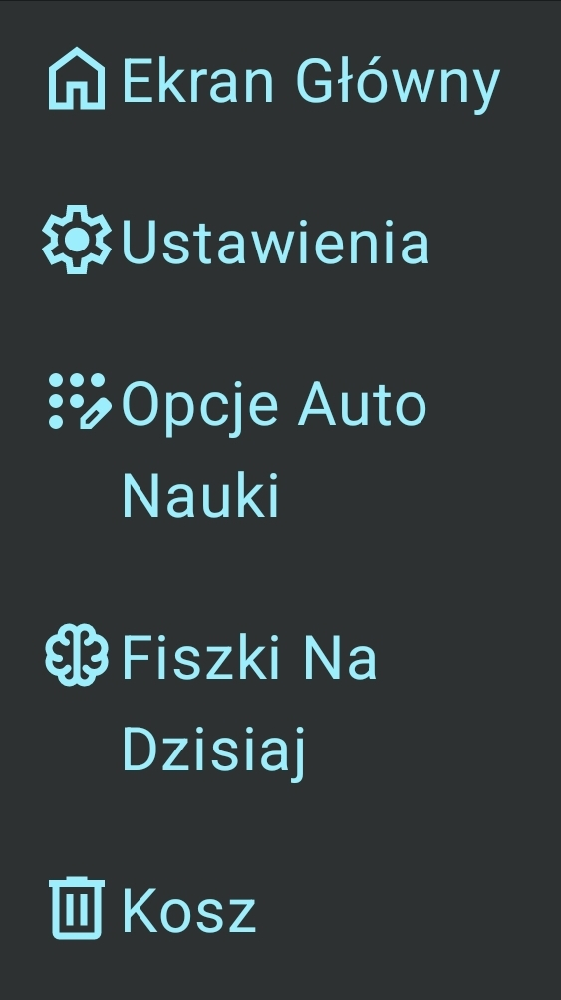

# Cardflare

Cardflare jest aplikacją stworzoną do zmuszania użytkownika do nauki fiszek według ustawionego przez niego planu auto nauki. Poza tym ułatwia on użytkownikowi zapamiętywanie poprzez użycie zaawansowanego algorytmu spaced repetition (powtarzania w interwałach) [FSRS](https://github.com/open-spaced-repetition/py-fsrs). Oferuje on także wiele dodatkowych funkcji takich jak dodawanie fiszek ze zdjęć.

## Po co nam uprawnienia?
Cardflare jest aplikacją stworzoną do zmuszania użytkownika do nauki fiszek według ustawionego przez niego planu auto nauki. Wcelu osiągnięcia tego aplikacja potrzebuje dostępu do **statystyk użytkowania** oraz do opcji wyświetlaj nad innymi dla wyświetlania fiszek.

## Jak Używać? / SzybkiTutorial
###Menu Główne
Po włączeniu aplikacji Znajdziesz się na ekranie głównym. W prawym dolnym rogu znajduje się menu tego ekranu po rozwinięciu go ukażą ci się te opcje:\

Jakoż, że inne opcje wymagają istnienia decków dodajmy nowy klikając Dodaj Deck.

###Dodawnaie Decków
Znajdujesz się teraz na ekranie dodawania decków. Z tąd możesz skonfigurować parametry nowego decku. Rozpocznijmy od dodania mu tagu. Kliknij dodaj tag i w pokazanym popupie wpisz nową nazwę taga np. pierwszy (nazwy nie mogą zawierać spacji) i kliknij plus koło tego pola aby dodać tag. Teraz naciśnij plus koło taga który pojawił się w liście poniżej aby dodać go do decku.
Spróbujmy teraz dodać fiszki ze zdjęcia. Kliknij przycisk **Dodaj Ze Zdjęcia** i wybierz zdjęcie, z którego chcesz wgrać fiszki. Zdjęcie otworzy się na nowym ekranie. Na górze ekranu znajduje się napis Strona A albo Strona B. Kliknij go i w dropdownie wybierz strona A. Teraz przejedź palcem po ekranie zaznaczając boksy, w których znajdują się wartości jednej ze stron fiszek (możesz też klikać pojedyńcze fiszki). Kiedy wybierzesz już wszystkie znów kliknij napis na górze i wybierz stronę B a następnie powtórz czynność wybierając wartości Strony B. Kiedy Skończysz kliknij Przycisk **Następny**.
####Tabela
Zobzczysz tabelę w której każda kolumna ma dwie opcje. Opcja **oka** przy wybraniu oka komórka jest ignorowana z tabeli. Opcja **link** łączy komórkę z komórką powyżej. Możesz spróbować teraz uporządkować tabelę wyrzucając komórki z błędnymi danymi i łącząc komórki zawierające te same definicje. Kiedy skończysz kliknij przycisk na dole.
Wrócisz na ekran dodawania, w którym możesz przetestować jeszcze jedną funkcję - funkcja auto uzupełniania. Funkcja ta sprawia, że podczas dodawania fiszek strony będą automatycznie tłumaczone po to by ułatwić dodawanie. Możesz wybrać tutaj dwa dowolne języki po jednym na każdą stronę. Wybierz np. Polski i Angielski. Teraz w polu na samej górze ekranu wpisz nazwę nowego decku i kliknij przycisk **Dodaj** na dole strony.

Znajdziesz się teraz na stronie głównej. Zauważ, że przytrzymanie nowo dodanego decku zaznacza go. Zaznaczony deck możesz zmodyfikować albo przenieść do kosza. Nie róbmy tego teraz. Odznacz deck i kliknij go.

###Menu fiszek
Jesteś teraz w menu fiszek tak samo jak decki fiszki możesz zaznaczać albo klikać, aby otworzyć ekran scrollowania.  W prawym dolnym rogu znajduje się menu tego ekranu po rozwinięciu go ukażą ci się te opcje:\

Opcja dodaj fiszkę otwiera ekran, w którym możesz dodawać fiszki korzystając ze wspomnianej funkcji auto uzupełniania (funkcja zacznie działać dopiero wtedy gdy odpowiednie modele się pobiorą).
We wspomnianym menu ekranu masz opcję **Ucz się**. Kliknij ją. 

###Ekran nauki
Na ekranie nauki ukazują ci się fiszki, które zaznaczyłeś lub jeśli nie zanzaczyłeś żadnej wszystkie fiszki danego decku. Aby obrócić fiszkę kliknij ją. Algorytm **FSRS** używa 4 opcji przyswojenia materiału są to stopniowo od najlepszego do najgorszego EASY, GOOD, HARD, AGAIN. możesz przeciągać fiszkę w rogi ekranu, aby wybierać ocenę tego jak dobrze zapamiętałeś fiszkę. Kiedy przesuniesz wszystkie fiszki ekran wróci do Menu fiszek. Wyjdź z menu fiszek naciskając przycisk androida wróć.

###Więcej O Menu Głównym
W górnej części menu głównego znajduje się pasek wyszukiwania. możesz w nim wpisać nazwę decku jakiego szukasz lub aby wyszukać po tagach wpisać **#nazwa_szukanego_taga**. W prawej części paska znajduje się menu sortowania, a w lewym menu ekranów kliknij je.

###Menu Ekranów\

Ukaże ci się taki pasek. Samemu możesz popróbować jakie funkcje zawiera każdy ekran bo nie będziemy się w to bardziej tutaj zagłębiać.
Powinieneś widzieć kolejno:
* Ekran Główny - To ten Ekran
* Ustawienia - Ustawieni Aplikacji
* Opcje Auto Nauki - Tam zaraz przejdziemy
* Fiszki na dzisiaj - gdzie znajdują się fiszki, które powinieneś dzisiaj powtórzyć
* Kosz - do którego możesz przenosić i z którego możesz przywracać fiszki oraz decki
Otwórz **Opcje Auto Nauki**

###Opcje Auto Nauki
W prawym dolnym rogu znajduje się menu tego ekranu po rozwinięciu go ukażą ci się opcja dodaj zasadę. Kliknij ją.\

Ukaże ci się takie menu. Najpierw kliknij opcje **Dodaj Aplikację**. Ukaże ci się pop up, w którym możesz wybrać aplikacje. Dodaj dowolną aplikację klikając przycisk plus koło jej nazwy (Nie wszystkie aplikacje się tu wyświetlają, nie ma tu aplikacji systemowych. Jeżeli chcesz blokować np. Youtube musisz włączyć tę opcje w ustawieniach aplikacji.). Zamknij popup i zaznacz opcje **Aktywne przy odblokowaniu**. Teraz Kliknij opcje **Dodaj Deck**. Wybierz ostatnio dodany deck i zamknij okno pop upu. Kliknij przycisk **Zapisz Zasadę**. Wyłącz telefon i odblokuj go, spróbuj także otworzyć dodaną przed tem aplikację. Pojawią ci się te fiszki z wybranego decku, które powinny być najszybciej powtórzone. 

###MIłej Zabawy i Nauki z Cardflare
